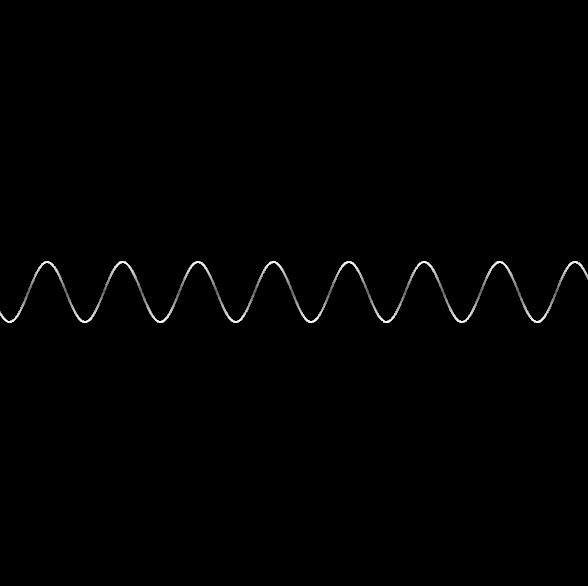

# rs-sine-wave
Sine wave render using Rust and Macroquad!
- Code formatted for Windows only, feel free to make it more compatible if needed 👍

## Usage🛠️
- <kbd>H</kbd> to open settings
1. Clone/Fork the repository
2. Run `cargo run` or `cargo build` to build a debug binary in the `./target/debug` directory
    - `cargo run --release` or `cargo build --release` to build a release binary in the `./target/release` directory
3. (If you used `cargo build`) Run the binary created in the appropriate directory listed above
